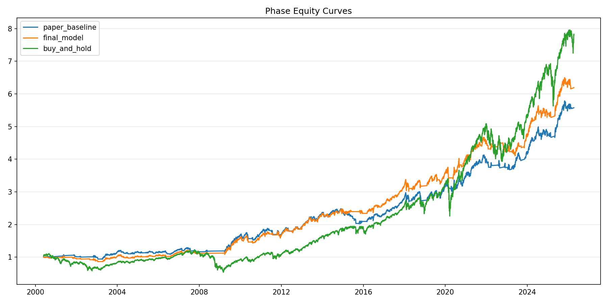
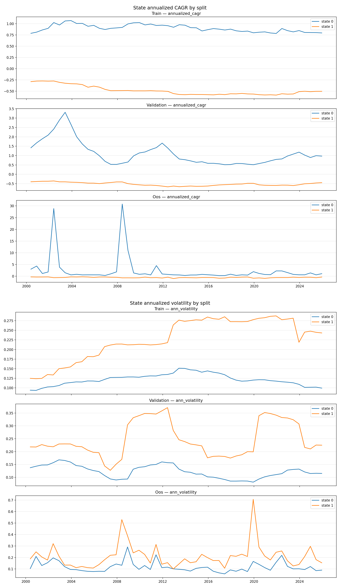
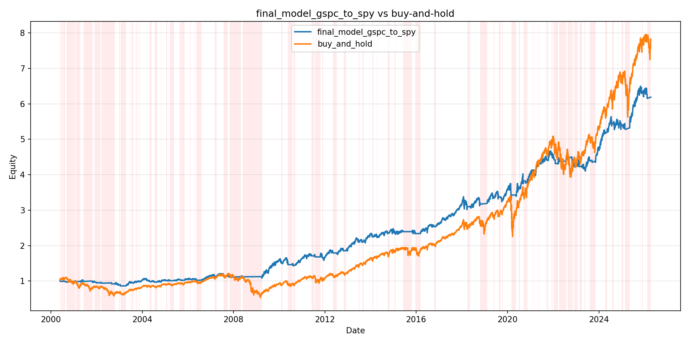
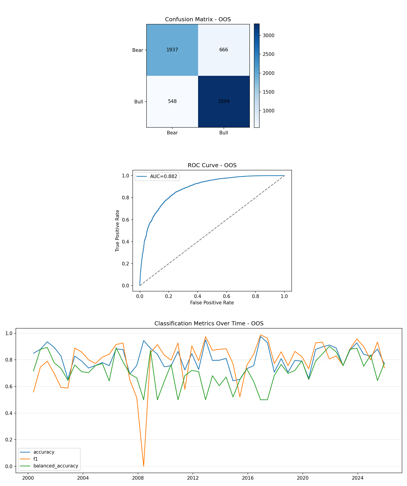

# Machine Learning Bull/Bear Market Prediction with Regime-Aware SPY Overlay

This repository is a single-asset research framework for **bull/bear market regime prediction** and **SPY overlay execution**. It uses `^GSPC` as the research asset, Jump Model labels as the regime target, and XGBoost as the predictive model, then maps predicted market states into dynamic `SPY` exposure under one unified long-sample backtest starting on `2000-05-26`.

The project is not a live trading system. It is a historical research and backtest framework designed to study whether regime-aware exposure can improve downside protection, recovery timing, and risk-adjusted performance relative to static buy-and-hold SPY.

## Main Takeaways

1. The final model improves on the paper baseline through a **simpler and more effective execution layer**, not through a radical change in the supervised model.
2. The main value of the system is **downside protection and faster re-risking after stress**, not a claim of persistent market-beating alpha.
3. The Jump Model layer remains useful because its two latent states map cleanly into a **high-return / lower-volatility** regime and a **low-return / higher-volatility** regime across train, validation, and OOS windows.

| Stage | Annual Return | Sharpe | Max Drawdown |
|---|---:|---:|---:|
| Paper baseline | 0.0694 | 0.5244 | -0.1873 |
| Final model | 0.0737 | 0.5731 | -0.1684 |
| Buy-and-hold | 0.0836 | 0.4172 | -0.5569 |

The chart below is the highest-signal comparison in the repository: paper baseline, final model, and buy-and-hold under the same unified protocol. The final model still trails buy-and-hold on headline return, but it improves both Sharpe and drawdown relative to the baseline and retains a much shallower drawdown profile than passive SPY.

## Motivation

Static buy-and-hold SPY compounds well over long horizons, but it is also exposed to deep bear-market drawdowns and can recover slowly after large regime shifts. A pure return-forecasting approach is often unstable, especially when the objective is to time market stress rather than predict small daily returns.

This project takes a different angle:

- identify **market regimes** instead of forecasting exact returns
- use a structured regime label generated by a **Jump Model**
- train a supervised ML model to predict the **next bull/bear state**
- translate those probabilities into a **regime-aware SPY overlay**

## Research Question

Can a machine-learning bull/bear classification framework built on `^GSPC` improve the risk-adjusted profile of `SPY` by:

- reducing exposure during historically hostile market states
- re-risking more effectively during recovery phases
- preserving enough upside participation to remain economically useful over a long sample

## Methodology

### Data and Signals

- Research asset: `^GSPC`
- Trade asset: `SPY`
- Macro panel: M0 macro features
- Unified backtest start date: `2000-05-26`
- Rolling protocol:
  - train lookback: `11 years`
  - validation lookback: `4 years`
  - OOS block: `6 months`

The feature set used in the active final model is the feature-enhanced set:

- baseline technical features
- refined return-window features
- recovery-oriented trend features
- M0 macro features

### Jump Model Regime Labels

Jump Model is used first to define the latent market states before any supervised prediction is attempted.

- configuration: `n_components = 2`, `jump_penalty = 0.0`
- role: convert the `^GSPC` market path into a structured two-state bull/bear label sequence
- purpose: provide a regime target that has economic meaning, rather than asking XGBoost to invent labels from scratch

The retained state semantics audit shows that the clustering is not arbitrary. Across train, validation, and OOS windows, one state consistently behaves like a **higher-return / lower-volatility** regime, while the other behaves like a **lower-return / higher-volatility** regime.

The chart below combines the state-level annualized CAGR panel and the annualized volatility panel. Together they show that one latent state systematically carries the higher-return / lower-volatility profile, while the other behaves like a lower-return / higher-volatility regime.

### XGBoost Bull/Bear Prediction

Once Jump Model has produced daily regime labels, the supervised learning problem is defined in strict time order:

- input at time `t`: current feature vector
- target: realized regime label at `t+1`

XGBoost is then trained on rolling windows to learn nonlinear relationships between features and future regime state. Validation is used to select the smoothing and execution settings that best translate predicted probabilities into an overlay decision rule.

This repository treats the ML problem carefully:

- Jump Model defines the regime label
- XGBoost predicts the next regime label
- the execution layer converts predicted probabilities into SPY exposure

That separation matters because classifier quality, state quality, and strategy quality are related but not identical.

### Regime-to-Exposure Overlay

The active final model is intentionally simple:

- dynamic smoothing over `{0, 4, 8, 12}`
- fixed single threshold `0.55`
- base rule:
  - `smoothed_probability >= 0.55 -> position = 1`
  - otherwise `position = 0`
- extra entry rule:
  - if `drawdown_from_peak <= -20%`
  - and `probability > 0.52`
  - then allow re-entry

This final version replaced more complex double-threshold and rising-entry branches because, under the unified protocol, the simpler rule translated model probabilities into better trade outcomes.

## Backtest Design

The project evaluates the strategy as a **research overlay on SPY**, not as a claim of production readiness.

- all mainline results use the same `^GSPC -> SPY` mapping
- transaction costs are included in the execution layer where applicable
- comparisons are made against:
  - a paper-style baseline
  - the final model
  - buy-and-hold SPY

The evaluation focus is not just absolute return. The more important questions are:

- does the overlay reduce drawdowns
- does it re-risk in a timely way after stress
- does it improve Sharpe and related risk-adjusted outcomes

## Key Results

Mainline summary under the unified protocol:

| Stage | Annual Return | Sharpe | Max Drawdown |
|---|---:|---:|---:|
| Full Oracle | 0.4348 | 3.7863 | -0.0462 |
| Paper baseline | 0.0694 | 0.5244 | -0.1873 |
| Feature enhanced | 0.0709 | 0.5368 | -0.1834 |
| Final model | 0.0737 | 0.5731 | -0.1684 |
| Buy-and-hold | 0.0836 | 0.4172 | -0.5569 |

Interpretation:

- the final model does **not** beat buy-and-hold on absolute annual return
- relative to the paper baseline, it improves **annual return, Sharpe, and max drawdown**
- relative to buy-and-hold, it retains a meaningfully shallower drawdown profile and a higher Sharpe

This supports the intended interpretation of the system: not a pure market-beating timer, but a **regime-aware SPY overlay** with historical evidence of risk-adjusted improvement.

## Visual Results

### Backtest Performance

The chart below compares the final model directly with buy-and-hold. Bear periods identified by the final model are shaded in red. This makes it easier to see that the overlay is primarily working by filtering risk during hostile conditions and then re-entering when state conditions improve.

### Model Prediction

The chart below combines the OOS confusion matrix, ROC curve, and time-series classification metrics. It shows how the final model separates future bull and bear labels, and how that classification quality varies across rolling windows.

## Repository Structure

- `assets/`: GitHub-safe README figures
- `data_raw/`: raw market and macro inputs
- `data_features/`: feature files and macro panels
- `scripts/`: active single-asset mainline scripts
- `results/single_asset_mainline/`: active mainline results
- `archive/scripts/`: archived exploratory scripts
- `archive/results/`: archived exploratory results

Active mainline scripts:

- [`scripts/run_oracle_gspc_to_spy.py`](scripts/run_oracle_gspc_to_spy.py)
- [`scripts/run_paper_baseline_gspc_to_spy.py`](scripts/run_paper_baseline_gspc_to_spy.py)
- [`scripts/run_feature_enhanced_gspc_to_spy.py`](scripts/run_feature_enhanced_gspc_to_spy.py)
- [`scripts/run_final_model_gspc_to_spy.py`](scripts/run_final_model_gspc_to_spy.py)
- [`scripts/run_diagnostics_baseline_vs_final.py`](scripts/run_diagnostics_baseline_vs_final.py)
- [`scripts/run_state_semantics_window_audit.py`](scripts/run_state_semantics_window_audit.py)
- [`scripts/single_asset_gspc_spy_common.py`](scripts/single_asset_gspc_spy_common.py)

## How to Run

To reproduce the active single-asset mainline:

1. Ensure the required raw files and macro panel are present.
2. Run the stages in order:
   - `python scripts\run_oracle_gspc_to_spy.py`
   - `python scripts\run_paper_baseline_gspc_to_spy.py`
   - `python scripts\run_feature_enhanced_gspc_to_spy.py`
   - `python scripts\run_final_model_gspc_to_spy.py`
   - `python scripts\run_diagnostics_baseline_vs_final.py`
   - `python scripts\run_state_semantics_window_audit.py`

Mainline outputs are written to:

- [`results/single_asset_mainline`](results/single_asset_mainline)

## Limitations

- This is a **research framework**, not a deployed trading system.
- Results are based on historical backtests and do not guarantee future performance.
- The final model still lags buy-and-hold SPY in absolute long-run annual return.
- The system depends on the stability of Jump Model regime semantics and on the ability of XGBoost to generalize across changing market environments.

## Future Work

- multi-asset extension beyond the current `^GSPC -> SPY` mapping
- more formal robustness tests on regime label stability
- richer cost and execution assumptions
- alternative regime definitions beyond the current two-state Jump Model setup

Rejected or archived directions include:

- double-threshold plus inertia hold under the unified protocol
- `rising_2d` extra entry layered on top of the drawdown-conditioned baseline
- portfolio-level drawdown stop overlays
- probability-to-future-return predictive-power tests
- jump-penalty grid search for the state-semantics audit

## Disclaimer

This repository is for research and educational purposes only. It is not financial advice, not an offer to buy or sell any security, and not a claim that similar results will hold in live trading. Any historical backtest evidence here should be interpreted as exploratory evidence about regime-aware overlay design, not as a guarantee of future returns.
